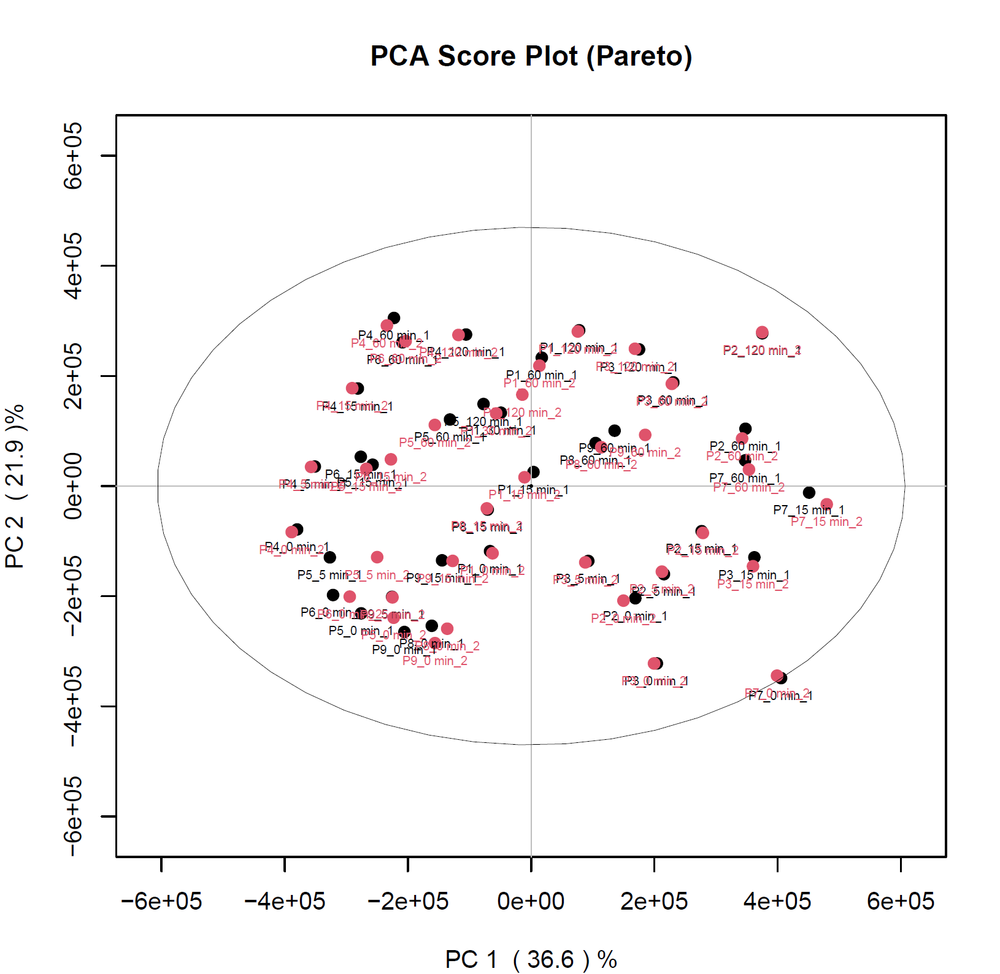
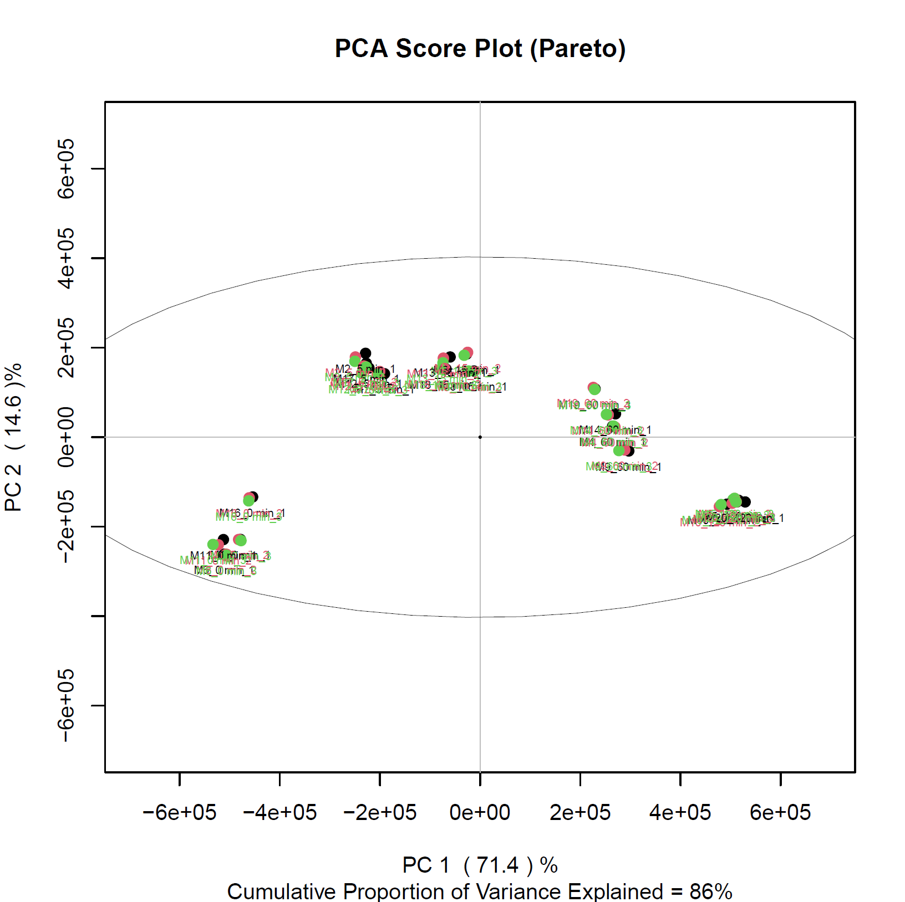

```{r intro-chunk, message=FALSE, warning=FALSE,}
#load the general libraries:
library(tidyverse)
library(rmarkdown) 
```

```{r normalisation, message=FALSE, warning=FALSE}
Filtering <-function(Input){
  #Find metabolites that have to be removed
  miss <- c()
  for(i in 1:ncol(Input)) {
    if(length(which(is.na(Input[,i]))) > (0.8*nrow(Input)))
    miss <- append(miss,i) 
    }
  #remove metabolites if any are found
  if(length(miss) ==0){
    print("There where no metabolites exluded")
    filtered_matrix <- Input
    } else {
      print(length(miss))
      print(" metabolites where removed")
      filtered_matrix <- Input[,-miss]
      }
}

MVI <-function(Input){
  replace(Input, is.na(Input), ((min(Input, na.rm = TRUE))/2))
}

TIC <- function(Input){
RowSums <- rowSums(Input)
Median_RowSums <- median(RowSums)#This will built the median
Data_TIC_Pre <- apply(Input, 2, function(i) i/RowSums)#This is dividing the ion intensity by the total ion count
Data_TIC <- Data_TIC_Pre*Median_RowSums#Multiplies with the median metabolite intensity 
Data_TIC <- cbind(rownames(Data_TIC), data.frame(Data_TIC, row.names=NULL, check.names=FALSE))%>%
  rename("Code"="rownames(Data_TIC)")
}
```

```{r Heatmap, warning= FALSE, message=FALSE}
#Input is the matrix of the metabolomics data (rownames= samples and columnnames=metabolites)
#cols1 = color code for the samples if applicable

library(gplots)
Heatmap <- function(InputMatrix, maximum, minimum, OutputPlotName){
  #Prepare the Input matrix and scale
  dataHeat_matrix <- data.matrix(InputMatrix)
  transpose<-t(scale(dataHeat_matrix))#scale by column
  min(transpose)
  max(transpose)
  t <- as.vector(t(transpose))
  #-------------------------------------------------------
  #functions to centralise the colour palette onto zero (credit to Aurelien!)
  createLinearColors <- function(numbers, withZero = T, maximum = 100)
  {
    if (min(numbers, na.rm = T) > 0)
    {
      if(withZero)
      {
        numbers <- c(0,numbers)
      }
      myPalette <- colorRampPalette(c("#F5B7B1",  "#EC7063", "#E74C3C", "#CB4335", "#A93226", "#922B21", "#7B241C", "#641E16"))
      myColors <- myPalette(maximum)
    }
    else
    {
      if (max(numbers, na.rm = T) < 0)
      {
        if(withZero)
        {
          numbers <- c(0,numbers)
        }
        myPalette <- colorRampPalette(c("#154360","#1A5276","#1F618D","#2874A6","#2E86C1","#3498DB","#5DADE2","#85C1E9","#D6EAF8"))
        myColors <- myPalette(maximum)
      }
      else
      {
        myPalette_pos <- colorRampPalette(c("#F5B7B1", "#EC7063","#E74C3C","#CB4335", "#A93226","#922B21","#7B241C","#641E16"))
        myPalette_neg <- colorRampPalette(c("#154360","#1A5276","#1F618D","#2874A6","#2E86C1","#3498DB","#5DADE2","#85C1E9","#D6EAF8"))
        
        npos <- length(numbers[numbers >= 0]) + 1
        nneg <- length(numbers[numbers <= 0]) + 1
  
        myColors_pos <- myPalette_pos(npos)
        myColors_neg <- myPalette_neg(nneg)
        
        myColors <- c(myColors_neg[-(nneg)], myColors_pos[-1])
      }
    }
    return(myColors)
  }
  #------------------------------------------
  # Color palette normalization to zero
  palette1 <- createLinearColors(t[t < 0],withZero = T , maximum = paste(maximum))
  palette2 <- createLinearColors(t[t > 0],withZero = T , maximum = paste(minimum))
  palette <- c(palette1,palette2)
  #------------------------------------------
  #Make the Heatmap
  Heatmap <- heatmap.2(transpose, #the data frame we use
          margins = c(7,14),#Figure Margins
          col=palette,
          scale="none", #data scaling
          hclustfun=function(d) hclust(d, method="ward.D"), 
          Rowv=T, 
          Colv=T, 
          symm=F,
          symkey=F,
          symbreaks=F,
          density.info="none", 
          trace="none",
          main = paste(OutputPlotName),
          key.title = "Metabolite Intensity",
          key.xlab = NA,
          cexRow=0.1, 
          cexCol=0.4, 
          ColSideColors=cols1)
  #ggsave(file=paste("Heatmap", OutputPlotName, ".pdf", sep="_"), plot=Heatmap, width=10, height=8)
  #ggsave(file=paste("Heatmap", OutputPlotName, ".png", sep="_"), plot=Heatmap, width=10, height=15)
    }
```

```{r PCA, message=FALSE, warning=FALSE}

library(devtools)
library(ggfortify)
library(ggplot2)
library(RColorBrewer)
library(viridisLite)
library(viridis)#https://cran.r-project.org/web/packages/viridis/vignettes/intro-to-viridis.html

PCA <- function(InputMatrix,OutputPlotName, DF, Color, Shape){
  PCA <- autoplot (prcomp(InputMatrix),
         data = DF,
         scale.=TRUE,
         colour = Color, #colour = row including the sample information to colour code
         label=T,
         label.size=1,
         label.repel = TRUE,
         loadings=T, #draws Eigenvectors
         loadings.label = TRUE,
         loadings.label.vjust = 1.2,
         loadings.label.size=2,
         loadings.colour="grey10",
         loadings.label.colour="grey10",
         color = "black",#outline colour
         fill = Color,#fill colour of the dots ("cyan4")
         alpha = 0.8,#controls the transparency: 1 = 100% opaque; 0 = 100% transparent.
         shape = Shape,#https://rpkgs.datanovia.com/ggpubr/reference/show_point_shapes.html, 21
         size = 3.5#size of the dot
         )+
    scale_fill_brewer(palette="Set1")+#Paired would also be a good option
    scale_color_brewer(palette="Set1")+
    labs(col=Color, size=1)+
    scale_shape_manual(values=c(22,21,24,23,25,7,8,11,12))+ #needed if more than 6 shapes are in place
    ggtitle(paste(OutputPlotName))
  ggsave(file=paste("Output/Figures/PCA_Color", OutputPlotName, ".pdf", sep="_"), plot=PCA, width=10, height=10)
  #ggsave(file=paste("PCA_Color", OutputPlotName, ".png", sep="_"), plot=PCA, width=10, height=10)
  plot(PCA)
}#works for up to 12 colours

PCA_NoLoadings <- function(InputMatrix,OutputPlotName, DF, Color, Shape){
  PCA <- autoplot (prcomp(InputMatrix),
         data = DF,
         scale.=TRUE,
         colour = Color, #colour = row including the sample information to colour code
         label=T,
         label.size=1,
         label.repel = TRUE,
         #loadings=T, #draws Eigenvectors
         #loadings.label = TRUE,
         #loadings.label.vjust = 1.2,
         #loadings.label.size=2,
         #loadings.colour="grey10",
         #loadings.label.colour="grey10",
         color = "black",#outline colour
         fill = Color,#fill colour of the dots ("cyan4")
         alpha = 0.8,#controls the transparency: 1 = 100% opaque; 0 = 100% transparent.
         shape = Shape,#https://rpkgs.datanovia.com/ggpubr/reference/show_point_shapes.html, 21
         size = 3.5#size of the dot
         )+
    scale_fill_brewer(palette="Set1")+#Paired would also be a good option
    scale_color_brewer(palette="Set1")+
    labs(col=Color, size=1)+
    scale_shape_manual(values=c(22,21,24,23,25,7,8,11,12))+ #needed if more than 6 shapes are in place
    theme_bw()+
    ggtitle(paste(OutputPlotName))
  ggsave(file=paste("Output/Figures/PCA_Color", OutputPlotName, ".pdf", sep="_"), plot=PCA, width=10, height=10)
  #ggsave(file=paste("PCA_Color", OutputPlotName, ".png", sep="_"), plot=PCA, width=10, height=10)
  plot(PCA)
}#works for up to 12 colours

PCA_Gradient <- function(InputMatrix,OutputPlotName, DF, Color, Shape){
  PCA <- autoplot (prcomp(InputMatrix),
         data = DF,
         scale.=TRUE,#recommended to scale data for PCA!
         colour = Color, #colour = row including the sample information to colour code
         label=T,
         label.size=1,
         label.repel = TRUE,
         loadings=T, #draws Eigenvectors
         loadings.label = TRUE,
         loadings.label.vjust = 1.2,
         loadings.label.size=2,
         loadings.colour="grey10",
         loadings.label.colour="grey10",
         color = "black",#outline colour
         fill = Color,#fill colour of the dots ("cyan4")
         alpha = 0.8,#controls the transparency: 1 = 100% opaque; 0 = 100% transparent.
         shape = Shape,#https://rpkgs.datanovia.com/ggpubr/reference/show_point_shapes.html, 21
         size = 3.5#size of the dot
         )+
    scale_color_viridis("magma")+
    scale_fill_viridis("magma")+
    scale_shape_manual(values=c(22,21,24,23,25,7,8,11,12))+ #needed if more than 6 shapes are in place
    ggtitle(paste(OutputPlotName))
  ggsave(file=paste("Output/Figures/PCA_Color", OutputPlotName, ".pdf", sep="_"), plot=PCA, width=10, height=10)
  #ggsave(file=paste("PCA_Color", OutputPlotName, ".png", sep="_"), plot=PCA, width=10, height=10)
  plot(PCA)
}

PCA_Gradient_NoLoadings <- function(InputMatrix,OutputPlotName, DF, Color, Shape){
  PCA <- autoplot (prcomp(InputMatrix),
         data = DF,
         scale.=TRUE,#recommended to scale data for PCA!
         colour = Color, #colour = row including the sample information to colour code
         label=T,
         label.size=1,
         label.repel = TRUE,
         #loadings=T, #draws Eigenvectors
         #loadings.label = TRUE,
         #loadings.label.vjust = 1.2,
         #loadings.label.size=2,
         #loadings.colour="grey10",
         #loadings.label.colour="grey10",
         color = "black",#outline colour
         fill = Color,#fill colour of the dots ("cyan4")
         alpha = 0.8,#controls the transparency: 1 = 100% opaque; 0 = 100% transparent.
         shape = Shape,#https://rpkgs.datanovia.com/ggpubr/reference/show_point_shapes.html, 21
         size = 3.5#size of the dot
         )+
    scale_color_viridis("magma")+
    scale_fill_viridis("magma")+
    scale_shape_manual(values=c(22,21,24,23,25,7,8,11,12))+ #needed if more than 6 shapes are in place#
    theme_bw()+
    ggtitle(paste(OutputPlotName))
  ggsave(file=paste("Output/Figures/PCA_Color", OutputPlotName, ".pdf", sep="_"), plot=PCA, width=10, height=10)
  #ggsave(file=paste("PCA_Color", OutputPlotName, ".png", sep="_"), plot=PCA, width=10, height=10)
  plot(PCA)
}

```

```{r DMA, warning= FALSE, message=FALSE}
#Establish function that calculates the Log2FC, the t-test p-value, and the bonferroni adjusted p-value
#Function:
library(gtools)#used for "foldchange"
DMA <-function(Log2FC_Condition1, Log2FC_Condition2,Stat_Condition1, Stat_Condition2, Output){
  #Log2FC
  FC_C1vC2 <- mapply(foldchange,Log2FC_Condition1,Log2FC_Condition2)
  Log2FC_C1vC2 <- as.data.frame(foldchange2logratio(FC_C1vC2, base=2))
  Log2FC_C1vC2 <- cbind(rownames(Log2FC_C1vC2), data.frame(Log2FC_C1vC2, row.names=NULL))
  names(Log2FC_C1vC2)[names(Log2FC_C1vC2) == "rownames(Log2FC_C1vC2)"] <- "Metabolite"
  names(Log2FC_C1vC2)[names(Log2FC_C1vC2) == "foldchange2logratio.FC_C1vC2..base...2."] <- "Log2FC"
  #t-test: alternative="two-sided" (alternative hypothesis)= default, paired=TRUE
  # https://www.rdocumentation.org/packages/stats/versions/3.6.2/topics/t.test
  T_C1vC2 <-mapply(t.test, x= as.data.frame(Stat_Condition2), y = as.data.frame(Stat_Condition1), SIMPLIFY = F)
  VecPVAL_C1vC2 <- c()
  for(i in 1:length(T_C1vC2)){
    p_value <- unlist(T_C1vC2[[i]][3])
    VecPVAL_C1vC2[i] <- p_value
  }
  Metabolite <- colnames(Stat_Condition2)
  PVal_C1vC2 <- data.frame(Metabolite, VecPVAL_C1vC2)
  #Benjamini Hochberg p-adjusted
  VecPADJ_C1vC2 <- p.adjust((PVal_C1vC2[,2]),method = "BH", n = length((PVal_C1vC2[,2])))
  PADJ_C1vC2 <- data.frame(Metabolite, VecPADJ_C1vC2)
  STAT_C1vC2 <- merge(PVal_C1vC2,PADJ_C1vC2, by="Metabolite")
  STAT_C1vC2 <- merge(Log2FC_C1vC2,STAT_C1vC2, by="Metabolite")
  names(STAT_C1vC2)[names(STAT_C1vC2) == "VecPVAL_C1vC2"] <- "p.val"
  names(STAT_C1vC2)[names(STAT_C1vC2) == "VecPADJ_C1vC2"] <- "p.adj"
  #write.csv(STAT_C1vC2, paste(Output), row.names= TRUE)
  Output <- STAT_C1vC2
}
```

```{r VolcanoPlot, warning= FALSE, message=FALSE}
# InputData needs to include columns: "Metabolite", "Log2FC", "p.adj" and "p.val"
library(ggrepel)
library(EnhancedVolcano)

VolcanoPlot_Multiple <- function(InputData_1, Condition_1, InputData_2, Condition2, InputData_3, Condition3, InputData_4, Condition4, OutputPlotName){
  #1. Include a column naming the set:
  InputData_1[,"comparison"]  <- as.character("InputData1")
  InputData_2[,"comparison"]  <- as.character("InputData2")
  InputData_3[,"comparison"]  <- as.character("InputData3")
  InputData_4[,"comparison"]  <- as.character("InputData4")
  #2. Add the colour:
  InputData_1[,"colour"]  <- as.character("#440154FF")
  InputData_2[,"colour"]  <- as.character("#404788FF")
  InputData_3[,"colour"]  <- as.character("#1F968BFF")
  InputData_4[,"colour"]  <- as.character("#FDE725FF")
  #3. Combine the files
  Combined_DMA <- rbind(InputData_1,InputData_2,InputData_3,InputData_4)
  #4.Prepare new colour scheme
  keyvals <- ifelse(
    Combined_DMA$colour == "#440154FF", "#440154FF",
    ifelse(Combined_DMA$colour == "#404788FF", "#404788FF",
    ifelse(Combined_DMA$colour == "#1F968BFF", "#1F968BFF",
    ifelse(Combined_DMA$colour == "#FDE725FF", "#FDE725FF",
           "black"))))
  keyvals[is.na(keyvals)] <- 'black'
  names(keyvals)[keyvals == '#440154FF'] <- paste(Condition_1)
  names(keyvals)[keyvals == '#404788FF'] <- paste(Condition2)
  names(keyvals)[keyvals == '#1F968BFF'] <- paste(Condition3)
  names(keyvals)[keyvals == '#FDE725FF'] <- paste(Condition4)
  names(keyvals)[keyvals == 'black'] <- 'X'
  #5. Make the Plot
  VolcanoPlot <- EnhancedVolcano (Combined_DMA,
                lab = Combined_DMA$Metabolite,#Metabolite name
                x = "Log2FC",#Log2FC
                y = "p.adj",#p-value or q-value
                xlab = bquote(~Log[2]~ "FC"),
                ylab = bquote(~-Log[10]~p.adj),#(~-Log[10]~adjusted~italic(P))
                pCutoff = 0.05,
                FCcutoff = 0.5,#Cut off Log2FC, automatically 2
                pointSize = 3,
                labSize = 1.5,
                colCustom = keyvals,
                titleLabSize = 16,
                col=c("black", "grey", "grey", "purple"),#if you want to change colors
                colAlpha = 0.5,
                title=paste(OutputPlotName),
                subtitle = bquote(italic("Differential Metabolomics Analysis (DMA)")),
                caption = paste0("total = ", (nrow(Combined_DMA)/4), " Metabolites"),
                #xlim = c(-3.5,2.5),
                ylim = c(0,(ceiling(-log10(Reduce(min,Combined_DMA$p.adj))))),
                #drawConnectors = TRUE,
                #widthConnectors = 0.5,
                #colConnectors = "black",
                cutoffLineType = "dashed",
                cutoffLineCol = "black",
                cutoffLineWidth = 0.5,
                legendLabels=c('No changes',"-0.5< Log2FC <0.5", 'p.adj<0.05 & -0.5< Log2FC <0.5"'),
                legendPosition = 'right',
                legendLabSize = 12,
                legendIconSize = 5.0,
                gridlines.major = FALSE,
                gridlines.minor = FALSE,
                )
  ggsave(file=paste("Output/Figures/VolcanoPlot_padj", OutputPlotName, ".pdf", sep="_"), plot=VolcanoPlot, width=10, height=8)
  #ggsave(file=paste("VolcanoPlot_padj", OutputPlotName, ".png", sep="_"), plot=VolcanoPlot, width=10, height=8)
  plot(VolcanoPlot)
  #6. Make the Plot
  VolcanoPlot1 <- EnhancedVolcano (Combined_DMA,
                lab = Combined_DMA$Metabolite,#Metabolite name
                x = "Log2FC",#Log2FC
                y = "p.val",#p-value or q-value
                xlab = bquote(~Log[2]~ "FC"),
                ylab = bquote(~-Log[10]~p.val),#(~-Log[10]~adjusted~italic(P))
                pCutoff = 0.05,
                FCcutoff = 0.5,#Cut off Log2FC, automatically 2
                pointSize = 3,
                labSize = 1.5,
                colCustom = keyvals,
                titleLabSize = 16,
                col=c("black", "grey", "grey", "purple"),#if you want to change colors
                colAlpha = 0.5,
                title=paste(OutputPlotName),
                subtitle = bquote(italic("Differential Metabolomics Analysis (DMA)")),
                caption = paste0("total = ", (nrow(Combined_DMA)/4), " Metabolites"),
                #xlim = c(-3.5,2.5),
                ylim = c(0,(ceiling(-log10(Reduce(min,Combined_DMA$p.val))))),
                #drawConnectors = TRUE,
                #widthConnectors = 0.5,
                #colConnectors = "black",
                cutoffLineType = "dashed",
                cutoffLineCol = "black",
                cutoffLineWidth = 0.5,
                legendLabels=c('No changes',"-0.5< Log2FC <0.5", 'p.val<0.05 & -0.5< Log2FC <0.5"'),
                legendPosition = 'right',
                legendLabSize = 12,
                legendIconSize = 5.0,
                gridlines.major = FALSE,
                gridlines.minor = FALSE,
                )
  ggsave(file=paste("Output/Figures/VolcanoPlot_pval", OutputPlotName, ".pdf", sep="_"), plot=VolcanoPlot1, width=10, height=8)
  #ggsave(file=paste("VolcanoPlot_pval", OutputPlotName, ".png", sep="_"), plot=VolcanoPlot1, width=10, height=8)
  plot(VolcanoPlot1)
}

VolcanoPlot_Multiple_TCA <- function(InputData_1, Condition_1, InputData_2, Condition2, InputData_3, Condition3, InputData_4, Condition4, OutputPlotName){
  #1. Include a column naming the set:
  InputData_1[,"comparison"]  <- as.character("InputData1")
  InputData_2[,"comparison"]  <- as.character("InputData2")
  InputData_3[,"comparison"]  <- as.character("InputData3")
  InputData_4[,"comparison"]  <- as.character("InputData4")
  #2. Add the colour:
  InputData_1[,"colour"]  <- as.character("#440154FF")
  InputData_2[,"colour"]  <- as.character("#404788FF")
  InputData_3[,"colour"]  <- as.character("#1F968BFF")
  InputData_4[,"colour"]  <- as.character("#FDE725FF")
  #3. Combine the files
  Combined_DMA <- rbind(InputData_1,InputData_2,InputData_3,InputData_4)
  #4.Prepare new colour scheme
  keyvals <- ifelse(
    Combined_DMA$colour == "#440154FF", "#440154FF",
    ifelse(Combined_DMA$colour == "#404788FF", "#404788FF",
    ifelse(Combined_DMA$colour == "#1F968BFF", "#1F968BFF",
    ifelse(Combined_DMA$colour == "#FDE725FF", "#FDE725FF",
           "black"))))
  keyvals[is.na(keyvals)] <- 'black'
  names(keyvals)[keyvals == '#440154FF'] <- paste(Condition_1)
  names(keyvals)[keyvals == '#404788FF'] <- paste(Condition2)
  names(keyvals)[keyvals == '#1F968BFF'] <- paste(Condition3)
  names(keyvals)[keyvals == '#FDE725FF'] <- paste(Condition4)
  names(keyvals)[keyvals == 'black'] <- 'X'
  #5. Make the Plot
  VolcanoPlot <- EnhancedVolcano (Combined_DMA,
                lab = Combined_DMA$Metabolite,#Metabolite name
                selectLab =c("succinate", "citrate/isocitrate", "aconitate", "fumarate", "malate"),
                x = "Log2FC",#Log2FC
                y = "p.adj",#p-value or q-value
                xlab = bquote(~Log[2]~ "FC"),
                ylab = bquote(~-Log[10]~p.adj),#(~-Log[10]~adjusted~italic(P))
                pCutoff = 0.05,
                FCcutoff = 0.5,#Cut off Log2FC, automatically 2
                pointSize = 3,
                labSize = 1.5,
                colCustom = keyvals,
                titleLabSize = 16,
                col=c("black", "grey", "grey", "purple"),#if you want to change colors
                colAlpha = 0.5,
                title=paste(OutputPlotName),
                subtitle = bquote(italic("Differential Metabolomics Analysis (DMA)")),
                caption = paste0("total = ", (nrow(Combined_DMA)/4), " Metabolites"),
                #xlim = c(-3.5,2.5),
                ylim = c(0,(ceiling(-log10(Reduce(min,Combined_DMA$p.adj))))),
                drawConnectors = TRUE,
                widthConnectors = 0.5,
                colConnectors = "black",
                labFace = 'bold',
                #boxedLabels = TRUE,
                cutoffLineType = "dashed",
                cutoffLineCol = "black",
                cutoffLineWidth = 0.5,
                legendLabels=c('No changes',"-0.5< Log2FC <0.5", 'p.adj<0.05 & -0.5< Log2FC <0.5"'),
                legendPosition = 'right',
                legendLabSize = 12,
                legendIconSize = 5.0,
                gridlines.major = FALSE,
                gridlines.minor = FALSE,
                )
  ggsave(file=paste("Output/Figures/VolcanoPlot_padj", OutputPlotName, ".pdf", sep="_"), plot=VolcanoPlot, width=10, height=8)
  #ggsave(file=paste("VolcanoPlot_padj", OutputPlotName, ".png", sep="_"), plot=VolcanoPlot, width=10, height=8)
  plot(VolcanoPlot)
  #6. Make the Plot
  VolcanoPlot1 <- EnhancedVolcano (Combined_DMA,
                lab = Combined_DMA$Metabolite,#Metabolite name
                selectLab =c("succinate", "citrate/isocitrate", "aconitate", "fumarate", "malate"),
                x = "Log2FC",#Log2FC
                y = "p.val",#p-value or q-value
                xlab = bquote(~Log[2]~ "FC"),
                ylab = bquote(~-Log[10]~p.val),#(~-Log[10]~adjusted~italic(P))
                pCutoff = 0.05,
                FCcutoff = 0.5,#Cut off Log2FC, automatically 2
                pointSize = 3,
                labSize = 1.5,
                colCustom = keyvals,
                titleLabSize = 16,
                col=c("black", "grey", "grey", "purple"),#if you want to change colors
                colAlpha = 0.5,
                title=paste(OutputPlotName),
                subtitle = bquote(italic("Differential Metabolomics Analysis (DMA)")),
                caption = paste0("total = ", (nrow(Combined_DMA)/4), " Metabolites"),
                #xlim = c(-3.5,2.5),
                ylim = c(0,(ceiling(-log10(Reduce(min,Combined_DMA$p.val))))),
                drawConnectors = TRUE,
                widthConnectors = 0.5,
                colConnectors = "black",
                labFace = 'bold',
                #boxedLabels = TRUE,
                cutoffLineType = "dashed",
                cutoffLineCol = "black",
                cutoffLineWidth = 0.5,
                legendLabels=c('No changes',"-0.5< Log2FC <0.5", 'p.val<0.05 & -0.5< Log2FC <0.5"'),
                legendPosition = 'right',
                legendLabSize = 12,
                legendIconSize = 5.0,
                gridlines.major = FALSE,
                gridlines.minor = FALSE,
                )
  ggsave(file=paste("Output/Figures/VolcanoPlot_pval", OutputPlotName, ".pdf", sep="_"), plot=VolcanoPlot1, width=10, height=8)
  #ggsave(file=paste("VolcanoPlot_pval", OutputPlotName, ".png", sep="_"), plot=VolcanoPlot1, width=10, height=8)
  plot(VolcanoPlot1)
}

VolcanoPlot_Pathways <- function(InputData, OutputPlotName){
#Prepare new colour scheme:
  keyvals <- ifelse(
    InputData$Pathway == "amino acid and conjugate", "blue",
    ifelse(InputData$Pathway == "glycolysis and PPP", "red",
    ifelse(InputData$Pathway == "Carnitine metabolism", "gold4",
    ifelse(InputData$Pathway == "nucleotides", "seagreen",
    ifelse(InputData$Pathway == "purine metabolism", "darkorchid1",
    ifelse(InputData$Pathway == "pyrimidine metabolism", "darkorchid4",
    ifelse(InputData$Pathway == "redox homeostasis", "orange",
    ifelse(InputData$Pathway == "Fatty acid metabolism", "gold1",
    ifelse(InputData$Pathway == "TCA cycle", "firebrick4",
          "gray")))))))))
  keyvals[is.na(keyvals)] <- 'gray'
  names(keyvals)[keyvals == 'gray'] <- 'Other'
  names(keyvals)[keyvals == 'blue'] <- "Amino acid and Conjugates"
  names(keyvals)[keyvals == 'red'] <- "Glycolysis and PPP"
  names(keyvals)[keyvals == 'gold4'] <- "Carnitine metabolism"
  names(keyvals)[keyvals == 'seagreen'] <- "Nucleotides"
  names(keyvals)[keyvals == 'darkorchid1'] <- "Purine metabolism"
  names(keyvals)[keyvals == 'darkorchid4'] <- "Pyrimidine metabolism"
  names(keyvals)[keyvals == 'orange'] <- "Redox homeostasis"
  names(keyvals)[keyvals == 'gold1'] <- "Fatty acid metabolism"
  names(keyvals)[keyvals == 'firebrick4'] <- "TCA cycle"

#Make the VolcanoPlot
VolcanoPlot0<- EnhancedVolcano (InputData,
                lab = InputData$Metabolite,#Metabolite name
                #lab =NA,#No labels on the plot
                x = "Log2FC",#Log2FC
                y = "p.adj",#p-value or q-value
                xlab = bquote(~Log[2]~ "FC"),
                ylab = bquote(~-Log[10]~p.adj),#(~-Log[10]~adjusted~italic(P))
                pCutoff = 0.05,
                FCcutoff = 0.5,#Cut off Log2FC, automatically 2
                pointSize = 4,
                labSize = 0.2,
                titleLabSize = 16,
                colCustom = keyvals,
                colAlpha = 0.5,
                title= paste(OutputPlotName),
                subtitle = bquote(italic("Differential metabolomics analysis")),
                caption = paste0("total = ", nrow(InputData), " Metabolites"),
                xlim = c((ceiling(Reduce(min,InputData$Log2FC))+0.2),(ceiling(Reduce(max,InputData$Log2FC))+0.2)),
                ylim = c(0,(ceiling(-log10(Reduce(min,InputData$p.adj))))),
                #drawConnectors = TRUE,
                #widthConnectors = 0.5,
                #colConnectors = "black",
                #arrowheads=FALSE,
                cutoffLineType = "dashed",
                cutoffLineCol = "black",
                cutoffLineWidth = 0.5,
                #legendLabels=c('No changes',"-0.5< Log2FC <0.5","-0.5< Log2FC <0.5", 'p.adj<0.05 & -0.5< Log2FC <0.5"'),
                legendPosition = 'right',
                legendLabSize = 8,
                legendIconSize =4,
                gridlines.major = FALSE,
                gridlines.minor = FALSE,
                )
ggsave(file=paste("Output/Figures/VolcanoPlot_padj", OutputPlotName, "Pathway.pdf", sep="_"), plot=VolcanoPlot0, width=10, height=8)
  #ggsave(file=paste("VolcanoPlot_padj", OutputPlotName, "Pathway.png", sep="_"), plot=VolcanoPlot0, width=10, height=8)
  plot(VolcanoPlot0)

VolcanoPlot1<- EnhancedVolcano (InputData,
                lab = InputData$Metabolite,#Metabolite name
                #lab =NA,#No labels on the plot
                x = "Log2FC",#Log2FC
                y = "p.val",#p-value or q-value
                xlab = bquote(~Log[2]~ "FC"),
                ylab = bquote(~-Log[10]~p.val),#(~-Log[10]~adjusted~italic(P))
                pCutoff = 0.05,
                FCcutoff = 0.5,#Cut off Log2FC, automatically 2
                pointSize = 4,
                labSize = 0.2,
                titleLabSize = 16,
                colCustom = keyvals,
                colAlpha = 0.5,
                title=paste(OutputPlotName),
                subtitle = bquote(italic("Differential metabolomics analysis")),
                caption = paste0("total = ", nrow(InputData), " Metabolites"),
                xlim = c((ceiling(Reduce(min,InputData$Log2FC))+0.2),(ceiling(Reduce(max,InputData$Log2FC))+0.2)),
                ylim = c(0,(ceiling(-log10(Reduce(min,InputData$p.val))))),
               # drawConnectors = TRUE,
               # widthConnectors = 0.5,
                #colConnectors = "black",
                #arrowheads=FALSE,
                cutoffLineType = "dashed",
                cutoffLineCol = "black",
                cutoffLineWidth = 0.5,
                #legendLabels=c('No changes',"-0.5< Log2FC <0.5","-0.5< Log2FC <0.5", 'p.adj<0.05 & -0.5< Log2FC <0.5"'),
                legendPosition = 'right',
                legendLabSize = 8,
                legendIconSize =4,
                gridlines.major = FALSE,
                gridlines.minor = FALSE,
                )
ggsave(file=paste("Output/Figures/VolcanoPlot_pval", OutputPlotName, "Pathway.pdf", sep="_"), plot=VolcanoPlot1, width=10, height=8)
  #ggsave(file=paste("VolcanoPlot_pval", OutputPlotName, "Pathway.png", sep="_"), plot=VolcanoPlot1, width=10, height=8)
  plot(VolcanoPlot1)
}

VolcanoPlot_Pathways_Select <- function(InputData, OutputPlotName){
#Prepare new colour scheme:
  keyvals <- ifelse(
    InputData$Pathway == "glycolysis and PPP", "red",
    ifelse(InputData$Pathway == "redox homeostasis", "orange",
    ifelse(InputData$Pathway == "TCA cycle", "firebrick4",
          "gray")))
  keyvals[is.na(keyvals)] <- 'gray'
  #names(keyvals)[keyvals == 'blue'] <- "Amino acid and Conjugates"
  names(keyvals)[keyvals == 'red'] <- "Glycolysis and PPP"
  #names(keyvals)[keyvals == 'gold4'] <- "Carnitine metabolism"
  #names(keyvals)[keyvals == 'seagreen'] <- "Nucleotides"
  #names(keyvals)[keyvals == 'darkorchid1'] <- "Purine metabolism"
  #names(keyvals)[keyvals == 'darkorchid4'] <- "Pyrimidine metabolism"
  names(keyvals)[keyvals == 'orange'] <- "Redox homeostasis"
  #names(keyvals)[keyvals == 'gold1'] <- "Fatty acid metabolism"
  names(keyvals)[keyvals == 'firebrick4'] <- "TCA cycle"
  names(keyvals)[keyvals == 'gray'] <- 'Other'

#Make the VolcanoPlot
VolcanoPlot0<- EnhancedVolcano (InputData,
                lab = InputData$Metabolite,#Metabolite name
                #lab =NA,#No labels on the plot
                x = "Log2FC",#Log2FC
                y = "p.adj",#p-value or q-value
                xlab = bquote(~Log[2]~ "FC"),
                ylab = bquote(~-Log[10]~p.adj),#(~-Log[10]~adjusted~italic(P))
                pCutoff = 0.05,
                FCcutoff = 0.5,#Cut off Log2FC, automatically 2
                pointSize = 4,
                labSize = 0.2,
                titleLabSize = 16,
                colCustom = keyvals,
                colAlpha = 0.5,
                title= paste(OutputPlotName),
                subtitle = bquote(italic("Differential metabolomics analysis")),
                caption = paste0("total = ", nrow(InputData), " Metabolites"),
                xlim = c((ceiling(Reduce(min,InputData$Log2FC))+0.2),(ceiling(Reduce(max,InputData$Log2FC))+0.2)),
                ylim = c(0,(ceiling(-log10(Reduce(min,InputData$p.adj))))),
                #drawConnectors = TRUE,
                #widthConnectors = 0.5,
                #colConnectors = "black",
                #arrowheads=FALSE,
                cutoffLineType = "dashed",
                cutoffLineCol = "black",
                cutoffLineWidth = 0.5,
                #legendLabels=c('No changes',"-0.5< Log2FC <0.5","-0.5< Log2FC <0.5", 'p.adj<0.05 & -0.5< Log2FC <0.5"'),
                legendPosition = 'right',
                legendLabSize = 8,
                legendIconSize =4,
                gridlines.major = FALSE,
                gridlines.minor = FALSE,
                )
ggsave(file=paste("Output/Figures/VolcanoPlot_padj", OutputPlotName, "Pathway_Select.pdf", sep="_"), plot=VolcanoPlot0, width=10, height=8)
  #ggsave(file=paste("VolcanoPlot_padj", OutputPlotName, "Pathway_Select.png", sep="_"), plot=VolcanoPlot0, width=10, height=8)
  plot(VolcanoPlot0)

VolcanoPlot1<- EnhancedVolcano (InputData,
                lab = InputData$Metabolite,#Metabolite name
                #lab =NA,#No labels on the plot
                x = "Log2FC",#Log2FC
                y = "p.val",#p-value or q-value
                xlab = bquote(~Log[2]~ "FC"),
                ylab = bquote(~-Log[10]~p.val),#(~-Log[10]~adjusted~italic(P))
                pCutoff = 0.05,
                FCcutoff = 0.5,#Cut off Log2FC, automatically 2
                pointSize = 4,
                labSize = 0.2,
                titleLabSize = 16,
                colCustom = keyvals,
                colAlpha = 0.5,
                title=paste(OutputPlotName),
                subtitle = bquote(italic("Differential metabolomics analysis")),
                caption = paste0("total = ", nrow(InputData), " Metabolites"),
                xlim = c((ceiling(Reduce(min,InputData$Log2FC))+0.2),(ceiling(Reduce(max,InputData$Log2FC))+0.2)),
                ylim = c(0,(ceiling(-log10(Reduce(min,InputData$p.val))))),
                #drawConnectors = TRUE,
                #widthConnectors = 0.5,
                #colConnectors = "black",
                #arrowheads=FALSE,
                cutoffLineType = "dashed",
                cutoffLineCol = "black",
                cutoffLineWidth = 0.5,
                #legendLabels=c('No changes',"-0.5< Log2FC <0.5","-0.5< Log2FC <0.5", 'p.adj<0.05 & -0.5< Log2FC <0.5"'),
                legendPosition = 'right',
                legendLabSize = 8,
                legendIconSize =4,
                gridlines.major = FALSE,
                gridlines.minor = FALSE,
                )
ggsave(file=paste("Output/Figures/VolcanoPlot_pval", OutputPlotName, "Pathway_Select.pdf", sep="_"), plot=VolcanoPlot1, width=10, height=8)
  #ggsave(file=paste("VolcanoPlot_pval", OutputPlotName, "Pathway_Select.png", sep="_"), plot=VolcanoPlot1, width=10, height=8)
  plot(VolcanoPlot1)
}

```

# Information
The notebook contains: Metabolomics data of patients/mice from the brain tissue at different timepoints after ischemia (0min, 5min, 15min, 30min, 60min, 120min) that were analysed by liquid chromatography-mass spectrometry (LC-MS). LC-MS data aquistion has been performed by the Frezza Laboratory, CECAD Research Center, Faculty of Medicine, University Hospital Cologne, Germany.\
\
Code for the R analysis can be reproduced by following this notebook. This includes the data normalisation, differential metabolite analysis and all subsequent plots (PCA plot, Volcano plot).

# Processing of the metabolomics data
Total pools of the intracellular metabolites are used.\
\
```{r, message=FALSE, warning=FALSE}
#Load the data:
##Human:
data_H <- read.csv("Input/20211212_Amin_humanbrain_HAP01.csv", check.names=FALSE)%>%
  separate("timepoint",c("timepoint_min","X"),sep=" ", remove=FALSE)
data_H <-data_H%>%
  unite("Sample",c("Patient_Number","timepoint"),sep="_", remove=FALSE)%>%
  unite("UniqueID",c("Sample","analytical_replicate"),sep="_", remove=FALSE)
data_H <-data_H[,c(1,3:4,2,5:6,8:241)]
data_H[, c(6:8)] <- sapply(data_H[, c(6:8)], as.numeric)

##Mouse:
data_M <- read.csv("Input/20211210_Amin_mousebrain_HAP02.csv", check.names=FALSE)%>%
  separate("timepoint",c("timepoint_min","X"),sep=" ", remove=FALSE)
data_M <-data_M%>%
  unite("Sample",c("Mouse_Number","timepoint"),sep="_", remove=FALSE)%>%
  unite("UniqueID",c("Sample","analytical_replicate"),sep="_", remove=FALSE)
data_M <-data_M[,c(1,3:4,2,7:8, 5:6,10:286)]
data_M[, c(6:285)] <- sapply(data_M[, c(6:285)], as.numeric)

#Prepare the matrix
x_H <- data_H[,10:240]
row.names(x_H) <- data_H$Code
x_H <- replace(x_H,x_H == 0,NA)

x_M <- data_M[,9:285]
row.names(x_M) <- data_M$Code
x_M <- replace(x_M,x_M == 0,NA)#Replace 0 with NA
```
\
Step1: Filtering 80% Rule\
Metabolites which where detected with "NA" in more than 80% of the samples are excluded: Here none.\
\
Step2: Missing Value Imputation (MVI)
   - We will search for the smallest detected value (x)\
   - We will divide this value by 2 (x:2)\
   - We will replace all "NA" with the value (x:2)\
\
Step3: Normalisation\
Normalisation to total ion count (TIC)
```{r, message=FALSE, warning=FALSE, include=FALSE}
#Human
H_filt <- Filtering(Input=x_H)
H_MVI <-MVI(H_filt)
H_TIC <- TIC(H_MVI)

#Mouse
M_filt <- Filtering(Input=x_M)
M_MVI <-MVI(M_filt)
M_TIC <- TIC(M_MVI)

#Merge with SampleInfo
H_norm <-  merge(data_H[,1:9], H_TIC, by="Code", check.names=FALSE)
M_norm <-  merge(data_M[,1:8], M_TIC, by="Code", check.names=FALSE)

```

# Quality control
This step is important to detect outliers and find patterns in the data.

## Human
### Muma analysis
Perform ["muma"](https://cran.r-project.org/web/packages/muma/muma.pdf) (Metabolomics Univariate and Multivariate Analysis) analysis for outliers. This uses the Hotellin's T2 distribution test to estimate outliers (Here: Pareto scaling used).
```{r, eval=FALSE}
Muma_Intra_H <- H_norm
Muma_Intra_H <- Muma_Intra_H[,c(2,8,10:240)]
names(Muma_Intra_H)[names(Muma_Intra_H) == "UniqueID"] <- "sample"#Rename the rowname
names(Muma_Intra_H)[names(Muma_Intra_H) == "analytical_replicate"] <- "class"#Rename the rowname
write.csv(Muma_Intra_H, "Output/DataTables/Muma_Intra_H.csv", row.names = FALSE)

library(muma)#Only installs with R version 4.0.5 or older and has been run in R v4.0.5 with muma v.1.4.

explore.data("Output/DataTables/Muma_Intra_H.csv",#Data need to be imported as a .csv
             "Pareto",#scaling is performed
             normalize=FALSE,
             imputation = FALSE)
getwd()
#Test for Outlier based on geometric distances of each point in the PCA score plot from a 95:
Plot.pca(1,#an integer indicating the principal component to be plotted in x
         2,#an integer indicating the principal component to be plotted in y
         "Pareto",#scaling previously specified in the function ’explore.data’
         test.outlier=TRUE)#geometric outlier testing
```
\
The two analytical measurements of Patient 7, timepoint 0min are close to the border:\


The overview heatmap including all metabolites shows that Patient 7, timepoint 0 is no outlier and hence will not be removed.\
```{r, warning= FALSE, message=FALSE}
#Prepare InputData:
dataHeat <- H_norm
row.names(dataHeat) <- dataHeat$UniqueID
dim(dataHeat)
Input_dataHeat <- dataHeat[,10:240]

#Prepare sample color code:
cols1 <- case_when(dataHeat$Patient_Number == "P1"  ~ 'blue',
                   dataHeat$Patient_Number == "P2"  ~ 'deepskyblue',
                   dataHeat$Patient_Number == "P3"  ~ 'orange',
                   dataHeat$Patient_Number == "P4"  ~ 'red',
                   dataHeat$Patient_Number == "P5"  ~ 'green',
                   dataHeat$Patient_Number == "P6"  ~ 'yellow',
                   dataHeat$Patient_Number == "P7"  ~ 'pink',
                   dataHeat$Patient_Number == "P8"  ~ 'purple',
                   dataHeat$Patient_Number == "P9"  ~ 'grey',
                   TRUE ~ 'black')
  
#Make the Heatmap:
Heatmap(InputMatrix=Input_dataHeat, maximum=35, minimum=65, OutputPlotName="Human")
```
\
Yet for the downstream analysis, we removed samples <  5mg tissue weight. This is important to avoid incomplete anoxia due to large surface/mass ratio and ambient air exposure, hence only samples >5mg tissue weight and non-vascular were included in the analysis. Therefore, we removed Patient 2 that did not meet those criteria.\
Moreover, we removed timepoint 30min of Patient 1, since the other patients do not have samples for this timepoint and hence we can not use it.
```{r, message=FALSE, warning=FALSE}
H_norm_out <- subset(H_norm, include =="yes")

#Safe data
write.csv(H_norm_out, "Output/DataTables/Human_TIC-normalised.csv", row.names = FALSE)
```

### PCA-Plots
1. Color code by patients --> which patients cluster together?\
2. Color code for analytical replicate --> is there a batch effect we need to correct for?\
3. Color code by time point --> is timepoint or patient the driving factor for clusters?

```{r, message=FALSE, warning=FALSE, echo=FALSE }
PCA_Data<-H_norm_out %>%
    mutate(analytical_replicate_ = case_when(`analytical_replicate`== 1  ~ 'Measurement 1',
                                  `analytical_replicate`== 2  ~ 'Measurement 2',
                                  TRUE ~ 'X'))
row.names(PCA_Data) <- PCA_Data$UniqueID

PCA_Data_m<- PCA_Data[,10:240]
PCA_Data_m <- apply(as.matrix(PCA_Data_m), 2, as.numeric)
row.names(PCA_Data_m) <- PCA_Data$UniqueID

#1. Patients
PCA(InputMatrix= PCA_Data_m, OutputPlotName= "Human_ColourPatients",DF=PCA_Data, Color = "Patient_Number", Shape = "analytical_replicate_" )

PCA_NoLoadings(InputMatrix= PCA_Data_m, OutputPlotName= "Human_ColourPatients_NoLoadings",DF=PCA_Data, Color = "Patient_Number", Shape = "analytical_replicate_" )

#2. Replicates
PCA(InputMatrix= PCA_Data_m, OutputPlotName= "Human_ColourReplicate",DF=PCA_Data, Color = "analytical_replicate_", Shape ="analytical_replicate_")

PCA_NoLoadings(InputMatrix= PCA_Data_m, OutputPlotName= "Human_ColourReplicate_NoLoadings",DF=PCA_Data, Color = "analytical_replicate_", Shape ="analytical_replicate_")

#3. Timepoints
PCA_Gradient (InputMatrix= PCA_Data_m, OutputPlotName= "Human_ColourTimepoint",DF=PCA_Data, Color = "timepoint_min", Shape = "analytical_replicate_")

PCA_Gradient (InputMatrix= PCA_Data_m, OutputPlotName= "Human_ColourTimepoint1",DF=PCA_Data, Color = "timepoint_min", Shape = "Patient_Number")

PCA_Gradient_NoLoadings (InputMatrix= PCA_Data_m, OutputPlotName= "Human_ColourTimepoint1_NoLoadings",DF=PCA_Data, Color = "timepoint_min", Shape = "Patient_Number")

```

## Mouse
### Muma analysis
```{r, eval=FALSE}
Muma_Intra_M <- M_norm
Muma_Intra_M <- Muma_Intra_M[,c(2,8,9:220)]
names(Muma_Intra_M)[names(Muma_Intra_M) == "UniqueID"] <- "sample"#Rename the rowname
names(Muma_Intra_M)[names(Muma_Intra_M) == "analytical_replicate"] <- "class"#Rename the rowname
write.csv(Muma_Intra_M, "Output/DataTables/Muma_Intra_M.csv", row.names = FALSE)

explore.data("Output/DataTables/Muma_Intra_M.csv",#Data need to be imported as a .csv
             "Pareto",#scaling is performed
             normalize=FALSE,
             imputation = FALSE)
getwd()
#Test for Outlier based on geometric distances of each point in the PCA score plot from a 95:
Plot.pca(1,#an integer indicating the principal component to be plotted in x
         2,#an integer indicating the principal component to be plotted in y
         "Pareto",#scaling previously specified in the function ’explore.data’
         test.outlier=TRUE)#geometric outlier testing
```
\
We do not have any outliers.\

```{r}
#Safe data
write.csv(M_norm, "Output/DataTables/Mouse_TIC-normalised.csv", row.names = FALSE)
```
### PCA-Plots
1. Color code by patients --> which patients cluster together?\
2. Color code for analytical replicate --> is there a batch effect we need to correct for?\
3. Color code by time point --> is timepoint or patient the driving factor for clusters?

```{r, message=FALSE, warning=FALSE}
PCA_Data<-M_norm%>%
    mutate(analytical_replicate_ = case_when(`analytical_replicate`== 1  ~ 'Measurement 1',
                                  `analytical_replicate`== 2  ~ 'Measurement 2',
                                  `analytical_replicate`== 3  ~ 'Measurement 3',
                                  TRUE ~ 'X'))

PCA_Data_m<- PCA_Data[,9:285]
PCA_Data_m <- apply(as.matrix(PCA_Data_m), 2, as.numeric)
row.names(PCA_Data_m) <- PCA_Data$UniqueID

#1. Mouse
PCA_Gradient(InputMatrix= PCA_Data_m, OutputPlotName= "Mouse_ColourMice",DF=PCA_Data, Color = "biological_replicate", Shape = "analytical_replicate_" )

PCA_Gradient_NoLoadings(InputMatrix= PCA_Data_m, OutputPlotName= "Mouse_ColourPatients_NoLoadings",DF=PCA_Data, Color = "biological_replicate", Shape = "analytical_replicate_" )

#2. Replicates
PCA(InputMatrix= PCA_Data_m, OutputPlotName= "Mouse_ColourReplicate",DF=PCA_Data, Color = "analytical_replicate_", Shape ="analytical_replicate_")

PCA_NoLoadings(InputMatrix= PCA_Data_m, OutputPlotName= "Mouse_ColourReplicate_NoLoadings",DF=PCA_Data, Color = "analytical_replicate_", Shape ="analytical_replicate_")

#3. Timepoints
PCA_Gradient (InputMatrix= PCA_Data_m, OutputPlotName= "Mouse_ColourTimepoint",DF=PCA_Data, Color = "timepoint_min", Shape = "analytical_replicate_")

PCA_Gradient_NoLoadings (InputMatrix= PCA_Data_m, OutputPlotName= "Mouse_ColourTimepoint_NoLoadings",DF=PCA_Data, Color = "timepoint_min", Shape = "analytical_replicate_")

```

# Differential metabolomics analysis (DMA)
Each sample was measured (independent injections = analytical replicates) two times for the patients and three times for the mice. Here we built the mean of these analytical replicates.\
These results will be used for plotting individual metabolites of interest and to perform the differential metabolite analysis.\
```{r, warning= FALSE, message=FALSE}
#Human
H_Means <- (H_norm[,10:240]) %>%
  group_by(H_norm$Sample) %>%
  summarise_all(funs(mean))
H_Means <- merge(x=H_norm[,c(1,3:7,9)], y=H_Means, by.x ="Sample",by.y ="H_norm$Sample")
H_Means <- H_Means[!duplicated(H_Means$Sample),]
H_Means <- H_Means[,c(2,1,3:238)]
H_Means_out <- subset(H_Means, include =="yes")
write.csv(H_Means_out, "Output/DataTables/Human_TIC-normalised_Means.csv", row.names = FALSE)

#Mouse
M_Means <- (M_norm[,9:285]) %>%
  group_by(M_norm$Sample) %>%
  summarise_all(funs(mean))
M_Means <- merge(x=M_norm[,c(1,3:7)], y=M_Means, by.x ="Sample",by.y ="M_norm$Sample")
M_Means <- M_Means[!duplicated(M_Means$Sample),]
M_Means <- M_Means[,c(2,1,3:283)]
write.csv(M_Means, "Output/DataTables/Mouse_TIC-normalised_Means.csv", row.names = FALSE)
```
\
The DMA calculates the Log2FC of the comparison timepoint 0 versus timepoint X and the p-value by using a classic t-test. To adjust the p-value we use Benjamini Hochberg. 

## Human
1. 5min versus 0min\
2. 15min versus 0min\
3. 60min versus 0min\
4. 120min versus 0min\
\
*Noteworthy, only timepoints 0min, 15min and 60min was taken for all 8 patients, whilst timepoint 5 min and 120min was only taken for 4 patients.
```{r , warning= FALSE, message=FALSE}
# Prepare the Dataframes:
Data_DMA<-H_Means_out[,-8]#remove d8-valine standard

#---------------------
## Single Replicates for each timepoints:
H_0min <-subset(Data_DMA,timepoint == "0 min" ,select=c(8:237))
H_5min <-subset(Data_DMA,timepoint == "5 min" ,select=c(8:237))
H_15min <-subset(Data_DMA,timepoint == "15 min" ,select=c(8:237))
H_60min <-subset(Data_DMA,timepoint == "60 min" ,select=c(8:237))
H_120min <-subset(Data_DMA,timepoint == "120 min" ,select=c(8:237))

#---------------------
## Mean of the replicates:
Data_DMA_Means <- (Data_DMA[,8:237]) %>%
  group_by(Data_DMA$timepoint) %>%
  summarise_all(funs(mean))
#Extract the single conditions we want to use for the comparison
Min0 <-Data_DMA_Means[1,2:231]
Min5 <-Data_DMA_Means[4,2:231]
Min15 <-Data_DMA_Means[3,2:231]
Min60 <-Data_DMA_Means[5,2:231]
Min120 <-Data_DMA_Means[2,2:231]

#---------------------
## Apply function:

DMA_5minv0min_Human <- DMA(
  Log2FC_Condition1=Min5, 
  Log2FC_Condition2=Min0,
  Stat_Condition1=H_5min,
  Stat_Condition2=H_0min)

DMA_15minv0min_Human <- DMA(
  Log2FC_Condition1=Min15, 
  Log2FC_Condition2=Min0,
  Stat_Condition1=H_15min,
  Stat_Condition2=H_0min)

DMA_60minv0min_Human <- DMA(
  Log2FC_Condition1=Min60, 
  Log2FC_Condition2=Min0,
  Stat_Condition1=H_60min,
  Stat_Condition2=H_0min)

DMA_120minv0min_Human <- DMA(
  Log2FC_Condition1=Min120, 
  Log2FC_Condition2=Min0,
  Stat_Condition1=H_120min,
  Stat_Condition2=H_0min)

#Add metabolic pathways: manually assigned, based on a priori knowledge
FrezzaLib <- read.csv("Input/MetabolicPathways.csv", check.names=FALSE)

DMA_Pathways_5minv0min_Human <- merge(x=DMA_5minv0min_Human, y=FrezzaLib, by="Metabolite",all.x=TRUE)
write.csv(DMA_Pathways_5minv0min_Human,"Output/DataTables/Human_TotalPools_DMA_5minv0min.csv")

DMA_Pathways_15minv0min_Human <- merge(x=DMA_15minv0min_Human, y=FrezzaLib, by="Metabolite",all.x=TRUE)
write.csv(DMA_Pathways_15minv0min_Human,"Output/DataTables/Human_TotalPools_DMA_15minv0min.csv")

DMA_Pathways_60minv0min_Human <- merge(x=DMA_60minv0min_Human, y=FrezzaLib, by="Metabolite",all.x=TRUE)
write.csv(DMA_Pathways_60minv0min_Human,"Output/DataTables/Human_TotalPools_DMA_60minv0min.csv")

DMA_Pathways_120minv0min_Human <- merge(x=DMA_120minv0min_Human, y=FrezzaLib, by="Metabolite",all.x=TRUE)
write.csv(DMA_Pathways_120minv0min_Human,"Output/DataTables/Human_TotalPools_DMA_120minv0min.csv")

```

### Volcano Plots
Now we can overlay the different timepoints onto one plot, to visualize the landscape change.\
```{r, warning= FALSE, message=FALSE}
VolcanoPlot_Multiple(InputData_1=DMA_5minv0min_Human, Condition_1="5minv0min", InputData_2=DMA_15minv0min_Human, Condition2="15minv0min", InputData_3=DMA_60minv0min_Human, Condition3="60minv0min", InputData_4=DMA_120minv0min_Human, Condition4="120minv0min", OutputPlotName="Xminv0min_Human")

VolcanoPlot_Multiple_TCA(InputData_1=DMA_5minv0min_Human, Condition_1="5minv0min", InputData_2=DMA_15minv0min_Human, Condition2="15minv0min", InputData_3=DMA_60minv0min_Human, Condition3="60minv0min", InputData_4=DMA_120minv0min_Human, Condition4="120minv0min", OutputPlotName="Xminv0min_Human_LabelSelect")

```
\
Now, we colour code for manually assigned (based on a priori knowledge) metabolic pathways and make individual plots.
```{r, warning= FALSE, message=FALSE}
#Plots:
VolcanoPlot_Pathways(DMA_Pathways_5minv0min_Human, "5minv0min_Human")
VolcanoPlot_Pathways(DMA_Pathways_15minv0min_Human, "15minv0min_Human")
VolcanoPlot_Pathways(DMA_Pathways_60minv0min_Human, "60minv0min_Human")
VolcanoPlot_Pathways(DMA_Pathways_120minv0min_Human, "120minv0min_Human")

VolcanoPlot_Pathways_Select(DMA_Pathways_5minv0min_Human, "5minv0min_Human")
VolcanoPlot_Pathways_Select(DMA_Pathways_15minv0min_Human, "15minv0min_Human")
VolcanoPlot_Pathways_Select(DMA_Pathways_60minv0min_Human, "60minv0min_Human")
VolcanoPlot_Pathways_Select(DMA_Pathways_120minv0min_Human, "120minv0min_Human")

```

## Mouse
1. 5min versus 0min\
2. 15min versus 0min\
3. 60min versus 0min\
4. 120min versus 0min\
\
* Noteworthy, only timepoints 0min, 15min and 60min was taken for all 8 patients, whilst timepoint 5 min and 120min was only taken for 4 patients.
```{r , warning= FALSE, message=FALSE}
# Prepare the Dataframes:
Data_DMA<-M_Means[,-7]#remove d8-valine!

#---------------------
## Single Replicates for each timepoints:
M_0min <-subset(Data_DMA,timepoint == "0 min" ,select=c(7:282))
M_5min <-subset(Data_DMA,timepoint == "5 min" ,select=c(7:282))
M_15min <-subset(Data_DMA,timepoint == "15 min" ,select=c(7:282))
M_60min <-subset(Data_DMA,timepoint == "60 min" ,select=c(7:282))
M_120min <-subset(Data_DMA,timepoint == "120 min" ,select=c(7:282))

#---------------------
## Mean of the replicates:
Data_DMA_Means <- (Data_DMA[,7:282]) %>%
  group_by(Data_DMA$timepoint) %>%
  summarise_all(funs(mean))
#Extract the single conditions we want to use for the comparison
MMin0 <-Data_DMA_Means[1,2:277]
MMin5 <-Data_DMA_Means[4,2:277]
MMin15 <-Data_DMA_Means[3,2:277]
MMin60 <-Data_DMA_Means[5,2:277]
MMin120 <-Data_DMA_Means[2,2:277]

#---------------------
## Apply function:

# change methods for p-adjust???
# paired p-value?
DMA_5minv0min_Mouse <- DMA(
  Log2FC_Condition1=MMin5, 
  Log2FC_Condition2=MMin0,
  Stat_Condition1=M_5min,
  Stat_Condition2=M_0min)

DMA_15minv0min_Mouse <- DMA(
  Log2FC_Condition1=MMin15, 
  Log2FC_Condition2=MMin0,
  Stat_Condition1=M_15min,
  Stat_Condition2=M_0min)

DMA_60minv0min_Mouse <- DMA(
  Log2FC_Condition1=MMin60, 
  Log2FC_Condition2=MMin0,
  Stat_Condition1=M_60min,
  Stat_Condition2=M_0min)

DMA_120minv0min_Mouse <- DMA(
  Log2FC_Condition1=MMin120, 
  Log2FC_Condition2=MMin0,
  Stat_Condition1=M_120min,
  Stat_Condition2=M_0min)

#Add metabolic pathways: manually assigned, based on a priori knowledge
DMA_Pathways_5minv0min_Mouse <- merge(x=DMA_5minv0min_Mouse, y=FrezzaLib, by="Metabolite",all.x=TRUE)
write.csv(DMA_Pathways_5minv0min_Mouse,"Output/DataTables/Mouse_TotalPools_DMA_5minv0min.csv")

DMA_Pathways_15minv0min_Mouse <- merge(x=DMA_15minv0min_Mouse, y=FrezzaLib, by="Metabolite", all.x=TRUE)
write.csv(DMA_Pathways_15minv0min_Mouse,"Output/DataTables/Mouse_TotalPools_DMA_15minv0min.csv")

DMA_Pathways_60minv0min_Mouse <- merge(x=DMA_60minv0min_Mouse, y=FrezzaLib, by="Metabolite",all.x=TRUE)
write.csv(DMA_Pathways_60minv0min_Mouse,"Output/DataTables/Mouse_TotalPools_DMA_60minv0min.csv")

DMA_Pathways_120minv0min_Mouse <- merge(x=DMA_120minv0min_Mouse, y=FrezzaLib, by="Metabolite", all.x=TRUE)
write.csv(DMA_Pathways_120minv0min_Mouse,"Output/DataTables/Mouse_TotalPools_DMA_120minv0min.csv")

```

### Volcano Plots
Now we can overlay the different timepoints onto one plot, to visualize the landscape change.\
```{r, warning= FALSE, message=FALSE}
#Use the colors of the PCA plot: https://www.thinkingondata.com/something-about-viridis-library/
VolcanoPlot_Multiple(InputData_1=DMA_5minv0min_Mouse, Condition_1="5minv0min", InputData_2=DMA_15minv0min_Mouse, Condition2="15minv0min", InputData_3=DMA_60minv0min_Mouse, Condition3="60minv0min", InputData_4=DMA_120minv0min_Mouse, Condition4="120minv0min", OutputPlotName="Xminv0min_Mouse")

VolcanoPlot_Multiple_TCA(InputData_1=DMA_5minv0min_Mouse, Condition_1="5minv0min", InputData_2=DMA_15minv0min_Mouse, Condition2="15minv0min", InputData_3=DMA_60minv0min_Mouse, Condition3="60minv0min", InputData_4=DMA_120minv0min_Mouse, Condition4="120minv0min", OutputPlotName="Xminv0min_Mouse_LabelSelect")

```
\
Now, we colour code for manually assigned (based on a priori knowledge) metabolic pathways and make individual plots.
```{r, warning= FALSE, message=FALSE}
#Plots:
VolcanoPlot_Pathways(DMA_Pathways_5minv0min_Mouse, "5minv0min_Mouse")
VolcanoPlot_Pathways(DMA_Pathways_15minv0min_Mouse, "15minv0min_Mouse")
VolcanoPlot_Pathways(DMA_Pathways_60minv0min_Mouse, "60minv0min_Mouse")
VolcanoPlot_Pathways(DMA_Pathways_120minv0min_Mouse, "120minv0min_Mouse")

VolcanoPlot_Pathways_Select(DMA_Pathways_5minv0min_Mouse, "5minv0min_Mouse")
VolcanoPlot_Pathways_Select(DMA_Pathways_15minv0min_Mouse, "15minv0min_Mouse")
VolcanoPlot_Pathways_Select(DMA_Pathways_60minv0min_Mouse, "60minv0min_Mouse")
VolcanoPlot_Pathways_Select(DMA_Pathways_120minv0min_Mouse, "120minv0min_Mouse")

```

# Information about packages and versions used 
```{r, warning= FALSE, message=FALSE}
sessionInfo()
```
